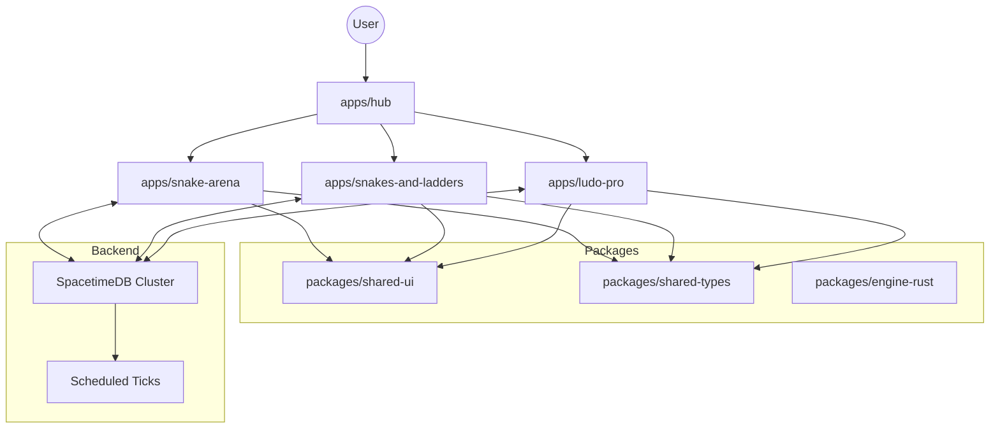

# Classic Games Collection 👾

A production-grade, Neo-Brutalist collection of classic board and arcade games. Built for high performance, deterministic multiplayer, and a premium visual experience.

## 🚀 Live Demo
[Launch the Game Hub](https://Ashborn-047.github.io/classic-games-collection/)

---

## 🛠️ Technology Stack

| Layer | Technology |
|---|---|
| **Frontend** | React 18 + TypeScript + Tailwind CSS v4 |
| **Animation** | Framer Motion |
| **State Management** | Zustand + Immer |
| **Backend** | SpacetimeDB (Rust Engine) |
| **Monorepo Tooling** | Turborepo + pnpm |
| **CI/CD** | GitHub Actions + GitHub Pages |

---

## 🏗️ System Architecture

The project follows a **Server-Authoritative Monorepo** architecture. This ensures that game logic is deterministic, cheat-proof, and shared across all frontend modules.

### 1. High-Level Design


### 2. Key Architectural Decisions
*   **Server-Authoritative Ticks**: All movement, collisions, and game rules are resolved on the SpacetimeDB server via `ScheduledReducers`. The client is a thin rendering shell that interpolates state for smoothness.
*   **Web Worker Rendering**: For high-frequency games like *Snake Arena*, the Canvas rendering pipeline runs in a dedicated Web Worker to maintain 60FPS, bypassing React's reconciliation lag.
*   **Zustand Atomic State**: Each game uses atomic state slices to handle real-time sync, disconnects, and reconnections with zero-jank.
*   **Shared Design System**: A custom Neo-Brutalist UI package (`shared-ui`) ensures a consistent and premium aesthetic across all games.

---

## 📁 Project Structure

```text
├── apps/
│   ├── hub/                   # Master Entry Point & Game Selector
│   ├── snake-arena/           # Real-time Web Worker Based Arcade Game
│   ├── snakes-and-ladders/    # Multi-theme Board Game (4 Themes)
│   └── ludo-pro/              # Strategy Board Game with Rust Engine
├── packages/
│   ├── shared-ui/             # Neo-Brutalist Component Library
│   ├── shared-types/          # Shared TypeScript Models & Interfaces
│   └── engine-rust/           # Shared Rust Logic (Collision, AI)
└── server/                    # Unified SpacetimeDB Rust Workspaces
```

---

## 🛡️ Identity & Anti-Cheat
*   **Identity**: Built-in SpacetimeDB `Identity` for secure, persistent player stats.
*   **Input Validation**: Strict server-side verification of all moves (e.g., rejecting 180° turns in Snake).
*   **Rate Limiting**: Integrated rate-limiting on input reducers to prevent macro-abuse.

---

## 🛠️ Local Development

### Prerequisites
- Node.js (v20+)
- pnpm (v10+)
- [SpacetimeDB CLI](https://spacetimedb.com/download)

### Run Locally
```bash
# Install dependencies
pnpm install

# Start the Hub in dev mode
pnpm run dev
```

---

## 📜 License
MIT
