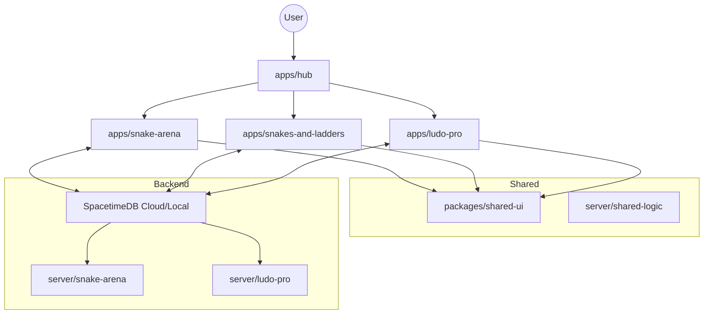

# Classic Games Collection 👾

A production-grade, **Neo-Brutalist** collection of classic board and arcade games. Built for high performance, server-authoritative multiplayer, and a premium visual experience using **SpacetimeDB**.

## 🚀 Live Demo
[Launch the Game Hub](https://ashborn-047.github.io/classic-games-collection/)

---

## 🛠️ Technology Stack

<p align="center">

<!-- Monorepo -->


<!-- Frontend -->


<!-- State Management -->


<!-- Backend -->


<!-- DevOps -->


</p>

---

## 🏗️ System Architecture

The project follows a **Server-Authoritative Monorepo** architecture. This ensures that game logic is deterministic, cheat-proof, and synchronized across all clients.

### 1. The "Project Restoration" Patterns
We utilize an **Isolated Game Engine** pattern for every game in the `apps/` directory. Each game is distilled into a clean, 3-file core:
- `App.jsx`: The React UI and bridge to the engine.
- `engine.js`: Pure gameplay logic, networking, and SpacetimeDB event handlers.
- `index.css`: Custom Neo-Brutalist styling (Retro glows, 3D dice, glassmorphism).

### 2. High-Level Design


---

## 📁 Project Structure

```text
├── apps/
│   ├── hub/                   # Master Entry Point & Game Selector
│   ├── snake-arena/           # Retro Arcade Snake (SpacetimeDB Synced)
│   ├── snakes-and-ladders/    # Multi-theme Board Game
│   └── ludo-pro/              # Strategy Board Game (Migrated to STDB)
├── packages/
│   └── shared-ui/             # Neo-Brutalist Component Library
├── server/                    # SpacetimeDB Rust Workspaces
│   ├── snake-arena/           # Snake Backend Logic
│   └── ludo-pro/              # Ludo Backend Logic
└── .github/workflows/         # Split Build -> Deploy Pipeline
```

---

## 🛠️ Local Development

### Prerequisites
- [Node.js](https://nodejs.org/) (v20+)
- [pnpm](https://pnpm.io/) (v10+)
- [SpacetimeDB CLI](https://spacetimedb.com/download)

### Setup
1. **Install Dependencies**:
   ```bash
   pnpm install
   ```
2. **Launch Dev Environment**:
   ```bash
   pnpm run dev
   ```
3. **Deploy Backend (Optional)**:
   ```bash
   cd server/snake-arena
   spacetime publish
   ```

---

## 📜 Repository Standards
- **Neo-Brutalist Design**: Bold borders, high contrast, and vibrant "retro-glow" aesthetics.
- **Engine Isolation**: Keep core game logic in `engine.js` to ensure the UI remains a thin, reactive shell.
- **Server Authority**: Never trust the client; always validate moves and state transitions in Rust.

---

## 🤝 Contributing
Please read [CONTRIBUTING.md](./CONTRIBUTING.md) for details on our code of conduct and the process for submitting pull requests.

## 📜 License
This project is licensed under the MIT License - see the [LICENSE](./LICENSE) file for details.
